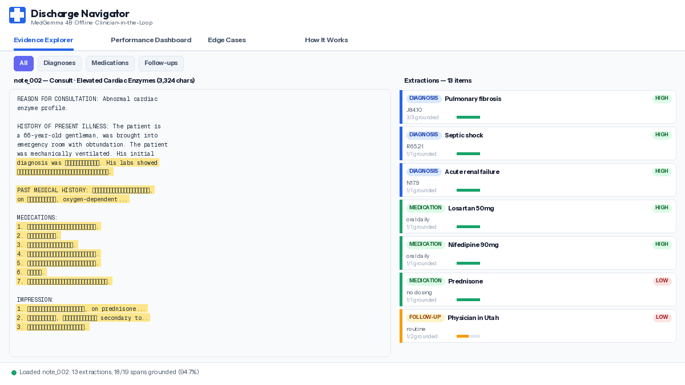

# Discharge Navigator

**Offline structuring of clinical discharge notes using MedGemma 4B — built for where cloud AI can't reach.**

Discharge summaries — what medications to take home, which follow-ups to attend, what warning signs to watch for — are critical handoff documents. But the tools to structure them don't exist where they're needed most: facilities with unreliable internet, no GPU hardware, and patient data that cannot leave the premises. Existing clinical AI assumes cloud infrastructure and stable connectivity. That's an architectural mismatch with the reality on the ground.

Discharge Navigator runs entirely offline on a consumer laptop — a 2.5 GB quantized model, CPU-only, zero internet after download. It reads a raw clinical note and extracts structured, evidence-grounded discharge packets: diagnoses, medications, follow-ups, red flags, and missing information — each backed by exact text spans from the source note that a clinician can verify before anything is applied.

<p align="center">
  
</p>

---

## Live Demo & Resources

| Resource | Link |
|----------|------|
| **Interactive Demo** | [huggingface.co/spaces/haguman/discharge-navigator-demo](https://huggingface.co/spaces/haguman/discharge-navigator-demo) |
| **Model Card** | [huggingface.co/haguman/discharge-navigator-medgemma](https://huggingface.co/haguman/discharge-navigator-medgemma) |
| **Video** | https://youtu.be/GjRunxRwvak?si=QHdN9JGx0G2Vcc0D |

---

## Quick Start (Kaggle)

1. Open the [Kaggle notebook](notebooks/04_kaggle_entrypoint.ipynb)
2. Enable GPU (T4) and add your `HF_TOKEN` as a Kaggle Secret
3. Run All — repo clones, model loads, live extraction runs, demo launches

## Quick Start (Local / Edge)

```bash
# Install Ollama
ollama serve
ollama pull williamljx/medgemma-4b-it-Q4_K_M-GGUF

# Run
pip install requests pydantic pandas gradio matplotlib
python src/demo_app.py
```

---

## Pipeline

```
Clinical Note → MedGemma 4B → Evidence Grounding → Schema Validation → Clinician Review
```

- **CPU only** — no GPU required for edge deployment
- **No internet required** — fully offline via Ollama + GGUF
- **Every claim traceable** — evidence spans verified as exact substrings of the source note
- **Human approval required** — assistive system, not autonomous

## Evaluation (50 notes, MTSamples CC0)

| Metric | Value |
|--------|-------|
| Parse rate | 92% (46/50) |
| Median latency (CPU) | 34s |
| Diagnosis grounding | 94.4% |
| Medication grounding | 94.5% |
| Follow-up grounding | 76.1% |
| Overall grounding | 87.5% |

4 failures — all caught by the schema gate, zero leaked. Documented transparently in `eval/results/failures_report.md`.

## Project Structure

```
src/
  demo_app.py       Gradio app — Evidence Explorer, Performance Dashboard, Edge Cases, How It Works
  navigator.py      Ollama + HuggingFace inference pipeline, retry strategy, prompt variants
  schemas.py        Pydantic v2 schemas with type coercion validators (the schema-first design)
  grounding.py      Exact substring verification of evidence spans against source text
  prompts.py        Prompt Variant A (contract) and Variant B (strict)
  hf_backend.py     HuggingFace Transformers backend for Kaggle T4
data/
  golden_note.txt   Golden test note for development
  mtsamples_subset.csv  50-note evaluation corpus (CC0)
eval/results/
  day2_metrics.json     50-note evaluation results with per-note breakdown
  failures_report.md    4 failure analyses
  samples/              Per-note extraction JSONs
notebooks/
  04_kaggle_entrypoint.ipynb  Kaggle submission notebook
```

## Inference Backends

| Backend | Environment | Model | Use Case |
|---------|-------------|-------|----------|
| Ollama (GGUF) | Local CPU, edge devices | `williamljx/medgemma-4b-it-Q4_K_M-GGUF` | Rural hospitals, air-gapped, field medical |
| HuggingFace Transformers | Kaggle T4 GPU | `google/medgemma-4b-it` (bf16) | Cloud reproducibility, evaluation |

Both backends trace to the same HAI-DEF open-weight model: `google/medgemma-4b-it` on Hugging Face. The notebook auto-detects the environment and selects the appropriate backend.

## License

Code: MIT | Dataset: CC0 (MTSamples) | Model: Google MedGemma terms apply
